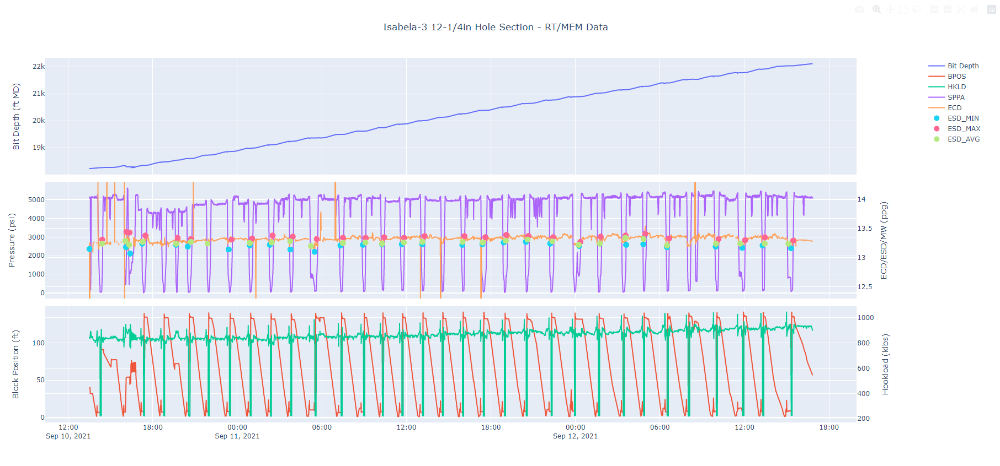

# ppfg-plots

## Instructions
The purpose of this project is to create interactive plots with memory and
realtime data. This automates some of the excel-based workflow the ppfg team
was following, and creates an interactive html plot that can be saved and
distributed for analysis and/or record keeping.<br>


### First Time Setup
1. Install `python3` from bp software center.
2. Install git: https://git-scm.com/download/win
3. Clone repository to local computer:<br>
```
git clone <url>
```
4. Create virtual environment:<br>
```
python -m venv <folder_name>
```
5. Activate virtual environment:<br>
```
cd <venv_folder_name>/Scripts
Activate.ps1
```
Note: if you see the error: **"execution of scripts is disabled on this
system"**, perform the following steps.<br>
- Open PowerShell as administrator from start menu
- Run the following command: `Set-ExecutionPolicy RemoteSigned`
6. Install requirements
```
pip install -r requirements.txt
```
7. Create the following folders in ppfg-plots directory:
- data
- data/bpwa
- data/memory
- data/events
- outputs

### Each Run
1. Download bpwa and memory data. Save in data/bpwa and data/memory folders
respectively.
2. Create events.csv file with date/time in first column, and event in second
column. Save in data/events folder.
3. Update config.py file with all necessary filepaths, preferences and
mnemonics.
4. Run the code with the following command in terminal (from ppfg-plots
directory):
```
python main.py
```

## Contributing
The wider team is free to contribute to the project. The `main` branch is the
production branch. All work should be done on the `development` branch, and
merged with a pull request to the main branch.<br>
To see which branch you are on:
```
git branch
```
To switch to an existing branch:
```
git checkout <branch_name>
```
To create a new branch and switch to it:
```
git checkout -b <new_branch_name>
```
